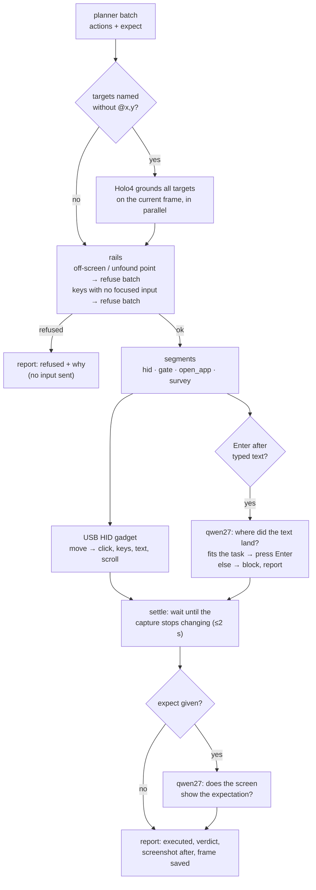
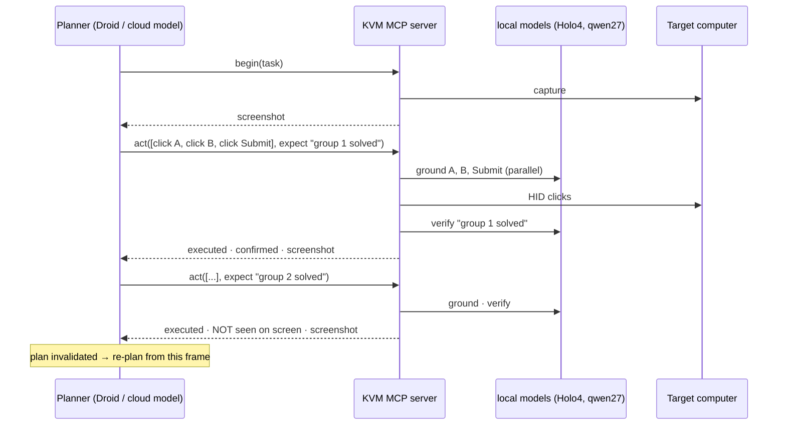

# One `act` call, inside the KVM

```mermaid
flowchart TD
  P["planner batch<br/>actions + expect"] --> G{"targets named<br/>without @x,y?"}
  G -- yes --> H["Holo4 grounds all targets<br/>on the current frame, in parallel"]
  G -- no --> R
  H --> R["rails<br/>off-screen / unfound point → refuse batch<br/>keys with no focused input → refuse batch"]
  R -- refused --> N["report: refused + why<br/>(no input sent)"]
  R -- ok --> S["segments<br/>hid · gate · open_app · survey"]
  S --> HID["USB HID gadget<br/>move → click, keys, text, scroll"]
  S --> E{"Enter after<br/>typed text?"}
  E -- yes --> Q["qwen27: where did the text land?<br/>fits the task → press Enter<br/>else → block, report"]
  HID --> W["settle: wait until the<br/>capture stops changing (≤2 s)"]
  Q --> W
  W --> V{"expect given?"}
  V -- yes --> C["qwen27: does the screen<br/>show the expectation?"]
  V -- no --> O
  C --> O["report: executed, verdict,<br/>screenshot after, frame saved"]
```

# One screenshot, several verified steps

```mermaid
sequenceDiagram
  participant D as Planner (Droid / cloud model)
  participant K as KVM MCP server
  participant L as local models (Holo4, qwen27)
  participant T as Target computer
  D->>K: begin(task)
  K->>T: capture
  K-->>D: screenshot
  D->>K: act([click A, click B, click Submit], expect "group 1 solved")
  K->>L: ground A, B, Submit (parallel)
  K->>T: HID clicks
  K->>L: verify "group 1 solved"
  K-->>D: executed · confirmed · screenshot
  D->>K: act([...], expect "group 2 solved")
  K->>L: ground · verify
  K-->>D: executed · NOT seen on screen · screenshot
  Note over D: plan invalidated → re-plan from this frame
```
